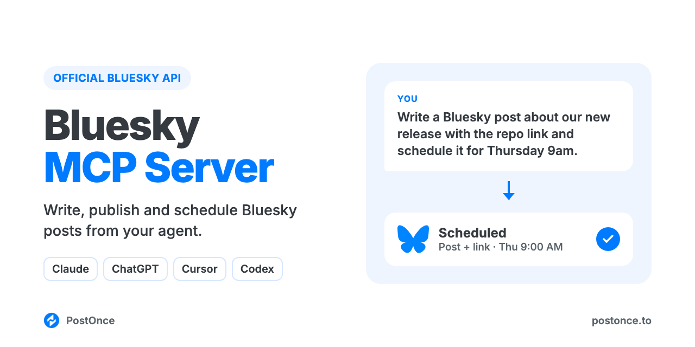

<p align="center"></p>

# Bluesky MCP Server

Bluesky MCP server for Claude, ChatGPT, Cursor and Codex. Your AI agent can write, publish and schedule Bluesky posts with images or a video through Bluesky's official API (the AT Protocol). There's no scraping, no browser automation and no Bluesky developer app to set up.

It runs on [PostOnce](https://postonce.to)'s hosted MCP server and comes with Bluesky skills, so your agent knows what a good Bluesky post looks like before it posts one.

```
You:    Write a Bluesky post about our new open-source release, with the
        repo link, and post it now.
Claude: Drafted it with the bluesky-post-writer skill: 262 characters, the
        link and #opensource become clickable when it posts.
        Published on PostOnce to @acme.dev. Here's the live link.
```

Full setup guide with examples: [postonce.to/mcp/bluesky](https://postonce.to/mcp/bluesky)

## What you can do

| Ask your agent to | How it works |
| --- | --- |
| Publish a text post now (up to 300 characters) | `create_post` on your connected Bluesky account |
| Schedule a post for later | `create_post` with `publish_at` |
| Post up to 4 images, or 1 video (up to 3 minutes, 100 MB) | `create_upload_url`, upload, then `create_post` with `media` |
| Use links, #hashtags and @mentions | They're turned into clickable rich text when the post is published |
| Save a draft to finish later | `create_draft` |
| Check whether a post went out, and get its URL | `get_post` |
| Change or cancel a scheduled post | `update_post`, `cancel_post` |
| Post the same thing to Bluesky and other platforms | Add more targets to `create_post` (LinkedIn, Instagram, TikTok, YouTube, X, Threads, Facebook, Pinterest) |

Not supported: threads and replies, quote posts, link preview cards, image alt text, reading your feed or notifications, analytics, DMs, and editing or deleting posts that are already published. Text over 300 characters is cut off, not rejected. This server publishes; it doesn't browse Bluesky for you.

## Setup (about a minute)

You need a [PostOnce account](https://postonce.to) (free for 7 days, no card) with your Bluesky account connected. Bluesky connects with an app password, not OAuth: create one in the Bluesky app under **Settings → Privacy and security → App passwords**, then enter your handle and that app password in PostOnce's connect form. An app password isn't your main password, and you can revoke it in Bluesky at any time.

**Claude (claude.ai and desktop) and ChatGPT:** add a custom connector with the URL below and sign in with PostOnce. No API key.

```
https://postonce.to/mcp
```

Step-by-step: [Claude](https://postonce.to/integrations/claude) · [ChatGPT](https://postonce.to/integrations/chatgpt)

**Claude Code, Codex and Cursor:** install the plugin. It adds the MCP connection and the skills together. Claude Code asks you to sign in to PostOnce the first time you use it (or run `/mcp` and pick postonce), so there's no key to copy. In Codex and Cursor, create an API key in [PostOnce preferences](https://postonce.to/dashboard/preferences) and give it to your client as the `POSTONCE_API_KEY` environment variable. Never paste the key, or your Bluesky app password, into chat.

```bash
# Claude Code
claude plugin marketplace add postoncehq/plugins
claude plugin install bluesky-mcp@postoncehq
```

Step-by-step: [Claude Code](https://postonce.to/integrations/claude-code) · [Codex](https://postonce.to/integrations/codex) · [Cursor](https://postonce.to/integrations/cursor)

**Any other MCP client:** point it at `https://postonce.to/mcp` (Streamable HTTP) with the header `Authorization: Bearer <your PostOnce API key>`.

## Skills included

| Skill | What it does |
| --- | --- |
| [`bluesky-post-writer`](skills/bluesky-post-writer/SKILL.md) | Writes Bluesky posts that fit in 300 characters and sound like a person, with links, hashtags and mentions that become clickable. |
| [`bluesky-bio-generator`](skills/bluesky-bio-generator/SKILL.md) | Writes a 256-character Bluesky bio, display name and pinned post idea for you to paste into your profile. |
| [`bluesky-custom-domain-handle`](skills/bluesky-custom-domain-handle/SKILL.md) | Walks you through using your own domain as your Bluesky handle, with the DNS TXT record or the /.well-known file. |
| [`bluesky-content-calendar`](skills/bluesky-content-calendar/SKILL.md) | Plans 1–4 weeks of Bluesky posts from your goals or a source you want to repurpose, drafts each one and schedules them on approval. |
| [`postonce`](skills/postonce/SKILL.md) | Publishing workflow: pick the right account, upload media, schedule, and confirm the post actually went live. |

## FAQ

**Is there an official Bluesky MCP server?**
This server uses Bluesky's official API (the AT Protocol) through PostOnce, and adds scheduling, drafts and posting to other platforms from the same request.

**Can Claude post to Bluesky?**
Yes, once it's connected to an MCP server that can publish, like this one. Claude writes the post, then calls `create_post`. It can post now or schedule for later.

**Is it safe for my Bluesky account?**
Yes. PostOnce connects with a Bluesky app password, not your main password. An app password can't change your password or delete your account, and you can revoke one in Bluesky at any time, which cuts off access immediately. Posts go through Bluesky's official API. Many MCP servers on GitHub drive a logged-in browser session or ask for your main password instead; avoid giving any tool your main password.

**Do I need a Bluesky developer account or API key?**
No. You create an app password in Bluesky's settings and enter it in PostOnce. There's no developer app to register.

**Can it post Bluesky threads?**
No. Each post is published on its own; replies and threads aren't supported. For something longer than 300 characters, split it into standalone posts or post the first part and add replies yourself in the Bluesky app.

**Does it show link previews?**
Links become clickable, but this server doesn't attach a link preview card. If the visual matters, add an image to the post.

**Is it free?**
The skills and this repo are free and MIT-licensed. Publishing runs through a PostOnce account, which you can try free for 7 days without entering a card. After that, see [pricing](https://postonce.to/pricing).

## Other platforms

The same connection posts everywhere PostOnce supports. Platform repos with their own skills:
[LinkedIn MCP](https://github.com/postoncehq/linkedin-mcp) · [Instagram MCP](https://github.com/postoncehq/instagram-mcp) · [TikTok MCP](https://github.com/postoncehq/tiktok-mcp) · [YouTube MCP](https://github.com/postoncehq/youtube-mcp) · [Facebook MCP](https://github.com/postoncehq/facebook-mcp) · [X (Twitter) MCP](https://github.com/postoncehq/x-mcp) · [Threads MCP](https://github.com/postoncehq/threads-mcp) · [Pinterest MCP](https://github.com/postoncehq/pinterest-mcp)

## License

MIT. See [LICENSE](LICENSE).
